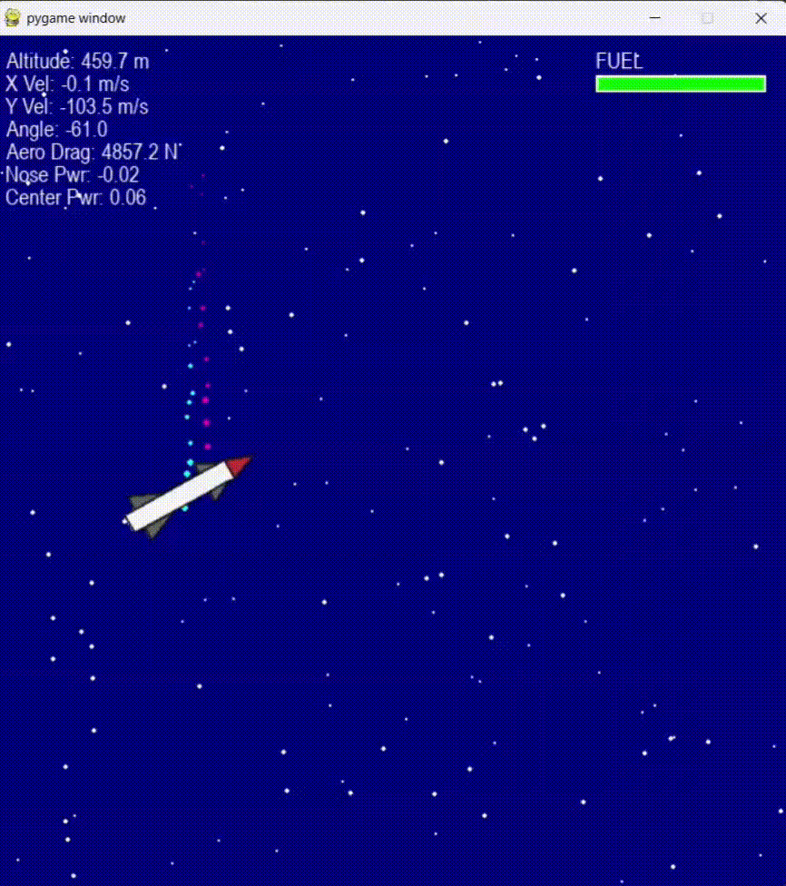
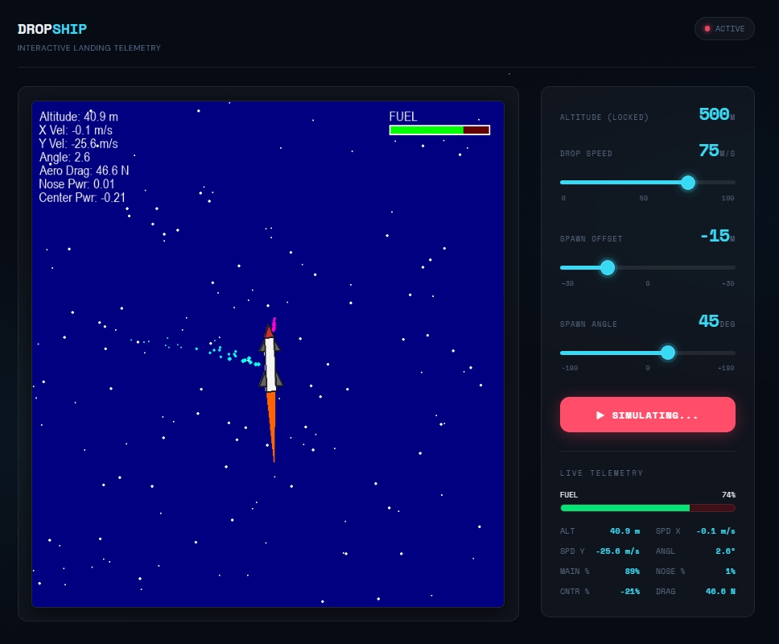
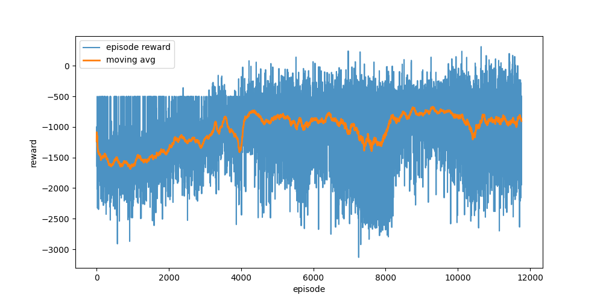
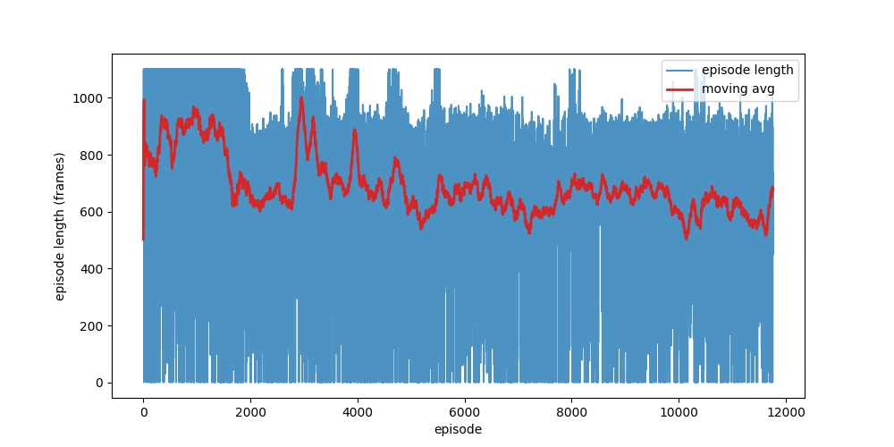

# 🚀 Dropship: Autonomous Rocket Landing via Reinforcement Learning

[](https://www.python.org/)
[](https://gymnasium.farama.org/)
[](https://stable-baselines3.readthedocs.io/)
[](https://flask.palletsprojects.com/)

**S8 CSE Honours Mini Project**

An interactive, continuous-control Reinforcement Learning project focused on teaching an AI agent to execute a complex "hoverslam" (suicide burn) rocket landing. Built from scratch using a custom Box2D physics environment, trained with Soft Actor-Critic (SAC), and deployed to a live Flask web dashboard with real-time telemetry streaming.

### 🎥 Demonstration

#### Algorithm Comparison: PPO vs. SAC

During the initial training phases, Proximal Policy Optimization (PPO) struggled with the chaotic 3D continuous action space, often converging on suboptimal local minima or failing to arrest terminal velocity. 


*Above: An early PPO agent failing to balance the thrust-to-weight ratio, resulting in a crash.*

By migrating to the entropy-maximizing Soft Actor-Critic (SAC) algorithm, the agent successfully learned the delicate multi-axis thrust balance required to execute a precise propulsive landing.


*Above: The fully trained SAC agent executing a flawless "hoverslam" maneuver to land safely on the pad.*

#### Interactive Web Dashboard

The trained neural policy is deployed into a production-ready Flask web application. It features a zero-latency Server-Sent Events (SSE) telemetry pipeline and an MJPEG video stream, allowing users to dynamically randomize drop conditions and watch the AI adapt in real-time.



---

## 🧠 The Environment & AI Architecture

The environment was built from the ground up using **Gymnasium** and **Box2D** to simulate realistic rigid-body physics, aerodynamic drag, and gravity.

### Observation Space (12 Dimensions)

The AI receives a continuous stream of telemetry data to make decisions:

1. Horizontal Position (Normalized)
2. Vertical Position (Normalized)
3. Horizontal Velocity
4. Vertical Velocity
5. Angle (Radians)
6. Angular Velocity
7. Remaining Fuel (%)
8. Exact Thrust-to-Weight Ratio
9. **The "Speedometer"**: The delta between current velocity and the ideal mathematical glide slope.
   10-12. **Action Memory**: The AI's previous frame actions for smooth continuous control.

### Action Space (3 Dimensions - Continuous)

Instead of discrete keyboard presses, the AI controls three continuous sliders `[-1.0, 1.0]`:

1. **Main Engine:** Raw vertical thrust.
2. **Center Thrusters:** Pure horizontal translation (sliding).
3. **Nose Thrusters:** Pure torque (gimbaling/tilting).

---

## 🧗‍♂️ The Engineering Journey & Challenges

Training an agent to land a rocket is notoriously difficult due to the sparse reward problem (you only know if you succeeded at the very end). Here is a breakdown of the development phases and the hurdles overcome:

### 1. The Algorithm Shift (PPO vs. SAC)

Initial experiments began using Proximal Policy Optimization (PPO). While highly stable, PPO struggled heavily with the complex, continuous 3D action space of the rocket's thrusters. The transition to **Soft Actor-Critic (SAC)** was the turning point. SAC's entropy maximization encouraged the agent to explore much more aggressively, finding the delicate balance between the main engine and side thrusters significantly faster.

### 2. Reward Shaping & The "Physics Death Trap" Loophole

Reinforcement learning agents are infamous for finding loopholes, and this project was no exception.

* **The Problem:** The environment featured a strict crash penalty (`-250` points) if the rocket touched down faster than `-5.0 m/s`. Simultaneously, it was rewarded for following an aggressive mathematical glide slope.
* **The Exploit:** At 2 meters above the pad, the aggressive glide slope demanded a falling speed of `-7.1 m/s`. The AI realized its thrust-to-weight ratio wasn't powerful enough to brake from `-7.1` to `-5.0` in just 2 meters. Because following the rules guaranteed a fatal crash, **the AI learned to permanently hover at 2 meters** to avoid touching the ground at all.
* **The Fix:** The target glide slope multiplier was softened (from `4.0` to `2.0`), giving the AI a survivable target of `-3.8 m/s` on final approach. A steep anti-hover penalty was introduced, forcing the AI to finally commit to the landing.

### 3. Domain Randomization & "Death Spawns"

To ensure the AI was robust, the starting positions were randomized (X-offset, altitude, angle, and starting drop speed). However, early iterations spawned the rocket in mathematically impossible scenarios (e.g., 30 meters off-center, upside down, falling at 100 m/s). The randomization was carefully calibrated into a discrete array grid to ensure every drop was physically solvable. 

### 4. Final Training Metrics (15.8 Million Steps)

After applying these reward shaping techniques and exploit mitigations, the SAC agent was forced to abandon suboptimal strategies and converge on the optimal "hoverslam" policy.

**Episodic Reward**

*The moving average (orange line) demonstrates the agent recovering from early exploration penalties and converging toward stable, positive touchdown jackpots.*

**Episode Length**

*The stabilization of the moving average (red line) indicates consistent landing times, proving the agent effectively overcame the "infinite hovering" physics death trap.*

---

## 🌐 The Web Deployment (Interactive Dashboard)

To test the model in real-time, the custom Pygame environment was hooked up to a full-stack **Flask web application**.

**Key Technical Features:**

* **Custom Domain Testing:** Users can select exact spawn coordinates via HTML sliders, which are injected directly into the Gym environment's `reset(options=...)` dictionary.
* **MJPEG Video Streaming:** The server intercepts the invisible Pygame `rgb_array`, compresses it using a `subsampling=0` JPEG pipeline for lossless text clarity, and streams it to the frontend via HTTP multi-part replacing at 60 FPS.
* **Live Telemetry via SSE:** To prevent network I/O bottlenecks from lagging the physics engine, traditional HTTP polling was scrapped. The dashboard utilizes **Server-Sent Events (SSE)** to maintain an open, one-way pipeline, streaming live altitude, velocity, and thrust percentages to the UI directly from the Box2D physics engine.

---

## ⚙️ Installation & Usage

### Prerequisites

* Python 3.10+
* Box2D (SWIG required for Windows)

### Setup

```bash
# 1. Clone the repository
git clone https://github.com/yourusername/dropship-rl.git
cd dropship-rl

# 2. Create and activate a virtual environment
python -m venv venv
source venv/bin/activate  # On Windows use: venv\\Scripts\\activate

# 3. Install dependencies
pip install -r requirements.txt
```

### Launching the Web Dashboard

To fly the fully trained `sac_phase3_final_v0` model interactively:

```bash
python app.py
```

Open [http://127.0.0.1:5000](http://127.0.0.1:5000) in your web browser.

### Running a Local Test Flight

To watch the AI perform automated test flights locally via Pygame:

```bash
python test_phase3.py
```
